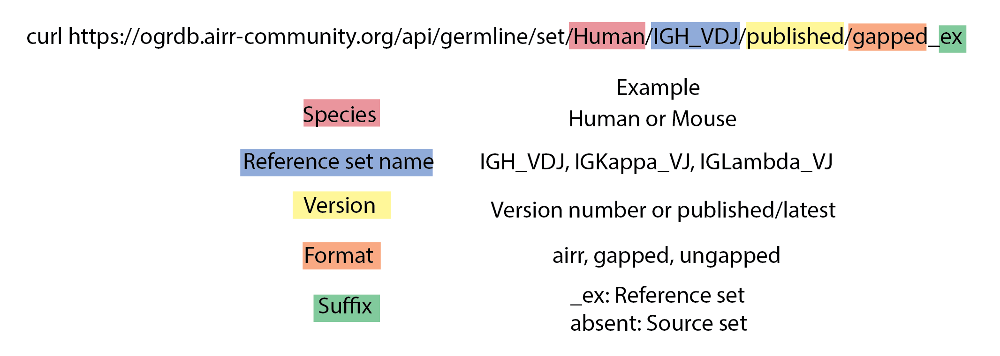

OGRDB REST API
=======================================================

`OGRDB`_ is the home of the AIRR-C Reference Sets, both `human`_ and `murine`_, and
is the de facto reference for matters concerning the germline sets.

Germline sets can be accessed from both the OGRDB webserver and the `REST API`_.
The germline sets are versioned (each version is also hosted on Zenodo) for reproducibility.

Below is a graphical representation of OGRDB's REST API which is used in the following sections.

.. _OGRDB: https://ogrdb.airr-community.org/
.. _human: https://www.frontiersin.org/journals/immunology/articles/10.3389/fimmu.2023.1330153/full
.. _murine: https://www.sciencedirect.com/science/article/pii/S2667119023000058?via%3Dihub
.. _REST API: https://wordpress.vdjbase.org/index.php/ogrdb_news/downloading-germline-sets-from-the-command-line-or-api/

